# BÁO CÁO BÀI TẬP / ĐỒ ÁN

## THÔNG TIN SINH VIÊN
- **Họ và tên:** Lê Tuấn Anh
- **Mã số sinh viên:** 24810320204
- **Lớp:** 20DTHxx
- **Tên môn học:** Lập trình.net / Windows Forms
- **Tên bài tập:** [Ôn tập Window Form]

---

## KẾT QUẢ THỰC HÀNH

---
Bài1
### 1. Ảnh màn hình Giao diện chính
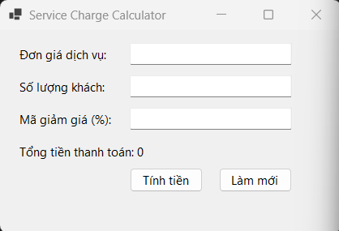

### 2. Ảnh màn hình Chức năng thực thi / Kết quả
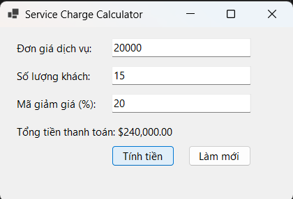

### 3. Ảnh màn hình Kiểm tra lỗi (Validation)

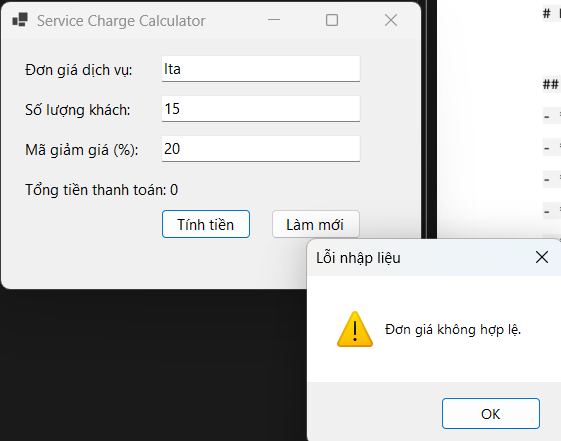

---
Bài2
### 1. Ảnh màn hình Giao diện chính
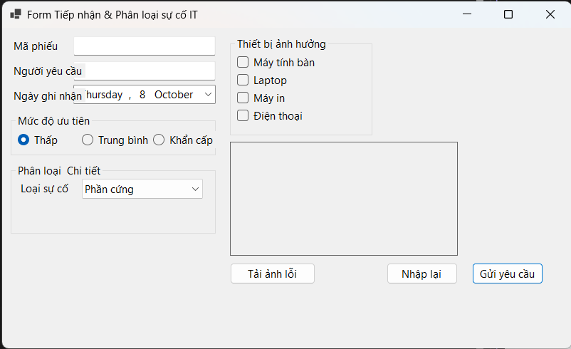

### 2. Ảnh màn hình Chức năng thực thi / Kết quả
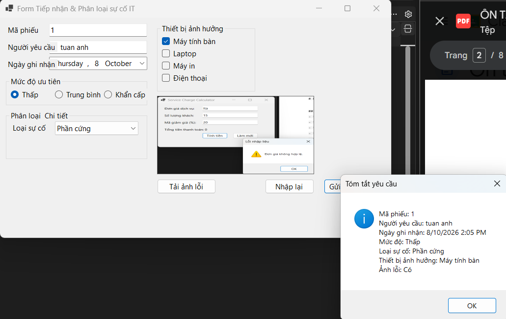

### 3. Ảnh màn hình Kiểm tra lỗi (Validation)

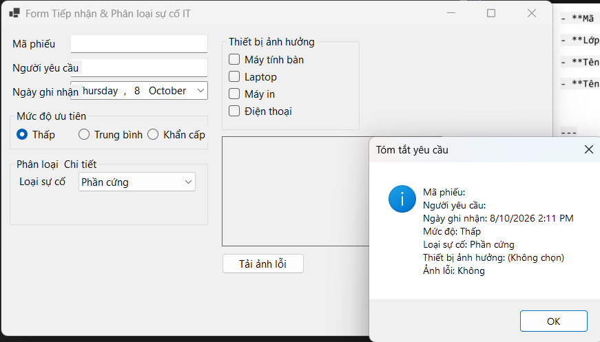

---
Bài3
### 1. Ảnh màn hình Giao diện chính
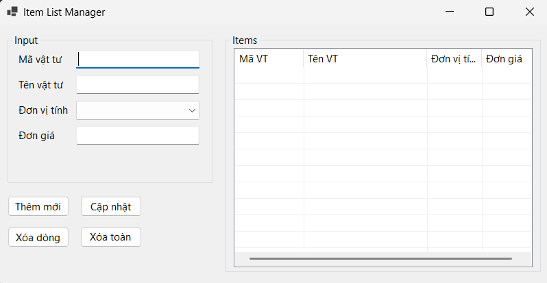

### 2. Ảnh màn hình Chức năng thực thi / Kết quả
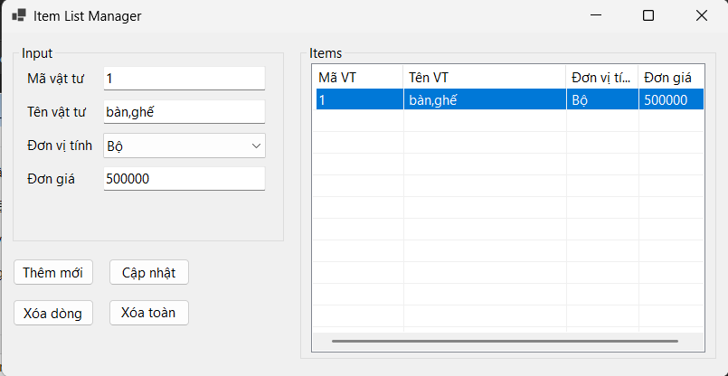

### 3. Ảnh màn hình Kiểm tra lỗi (Validation)

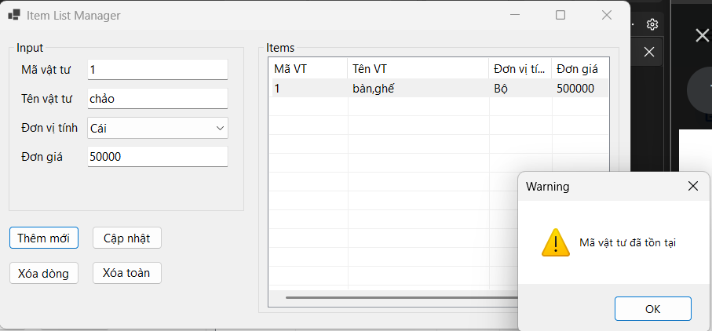

---
Bài4
### 1. Ảnh màn hình Giao diện chính
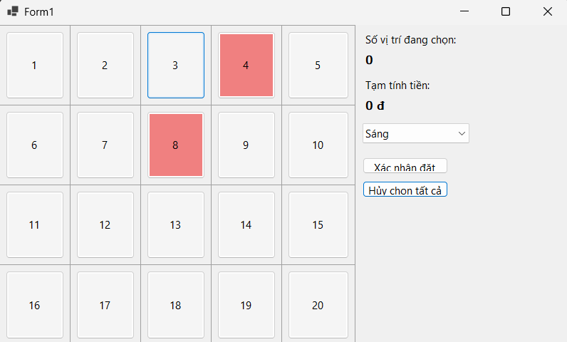

### 2. Ảnh màn hình Chức năng thực thi / Kết quả
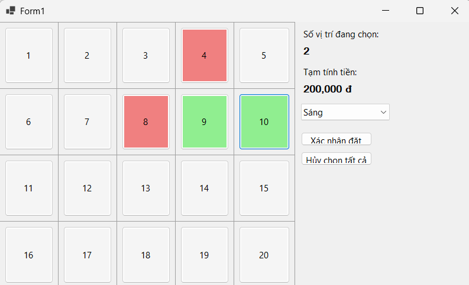

---
Bài5
### 1. Ảnh màn hình Giao diện chính
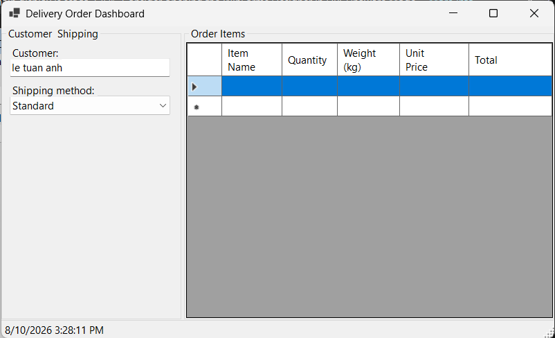

### 3. Ảnh màn hình Kiểm tra lỗi (Validation)

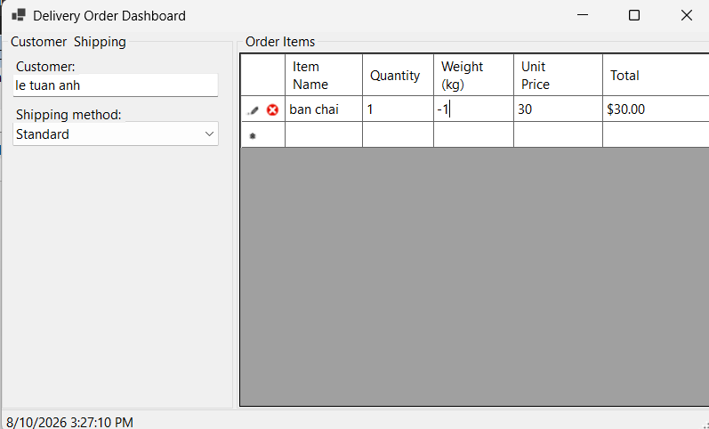
